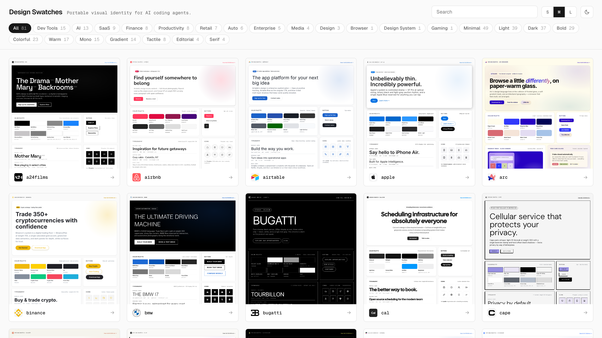
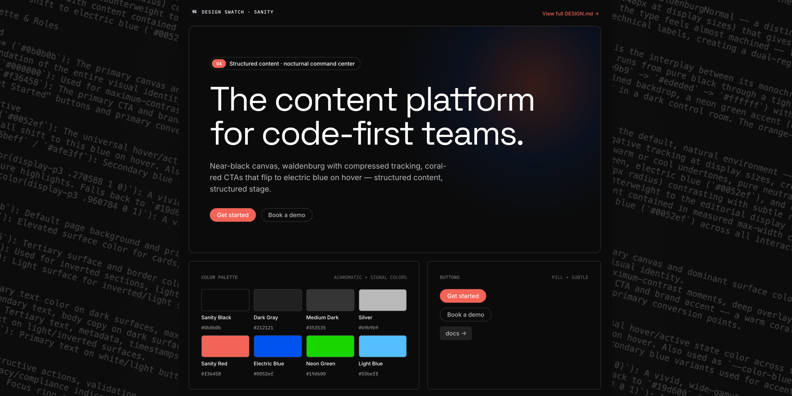

<h1 align="center">Design Swatches</h1>
<p align="center">Portable visual identity for AI coding agents.<br>
98-brand DESIGN.md corpus with a browsable explorer and a Claude Code skill.</p>
<p align="center"><a href="https://designmd.santiagoalonso.com"><strong>Browse -></strong></a></p>





---

## What this is

A corpus of 98 DESIGN.md files, one per real company, all in the same 9-section format. Plus a browsable gallery and the Claude Code skill that generated them.

AI coding agents produce generic UIs unless you hand them a detailed design system reference. Most design systems live locked inside Figma, Storybook, or tokens JSON, none of which paste cleanly into an LLM chat. DESIGN.md is the pasteable form: 9 sections of prose + tokens that describe a brand's visual identity well enough for an agent to rebuild a believable interface.

## What's inside

```
design-swatches/
├── getdesign-corpus/    # 98 DESIGN.md files (~250–550 lines each)
├── explorer/            # Browsable visual catalog of all 98
│   ├── index.html       # Filterable gallery (search, light/dark, by category & style)
│   └── bentos/          # One HTML "swatch" per brand
└── skill/design-md/     # Claude Code skill that generates new DESIGN.md files
```

## The skill

`skill/design-md/` is a Claude Code skill that produces a DESIGN.md from any URL. Point it at your own company's site:

```bash
cp -R skill/design-md ~/.claude/skills/
```

Then in any Claude Code session:

```
/design-md https://your-company.com
```

The skill pulls raw design tokens via [dembrandt](https://github.com/dembrandt/dembrandt), then uses Claude with 1–3 corpus files as voice references to write a structured 9-section DESIGN.md. Dembrandt tells you `#f36458` appears 12 times. This layer is what calls that coral Sanity's singular brand accent, reserved for CTAs, and flips to electric blue on hover. Raw tokens in, AI-usable design brief out.

Future prototypes built in that session land closer to your brand on the first try.

## The explorer

The explorer renders each DESIGN.md into a visible "design swatch" so you can scan all 98 at a glance. The 9-section format holds across Ferrari, Notion, A24, Mercury Weather, and Claude.

For reference only. These describe public brand identities, don't lift them into your own product.

## What's in a DESIGN.md

Each file follows the same 9-section structure:

1. Visual Theme & Atmosphere
2. Color Palette & Roles
3. Typography Rules
4. Component Stylings
5. Layout Principles
6. Depth & Elevation
7. Do's and Don'ts
8. Responsive Behavior
9. Agent Prompt Guide

The last section is the payload: copy-paste prompts an AI agent can use directly to build on-brand UI.

## Credits

- Token extraction via [dembrandt](https://github.com/dembrandt/dembrandt)
- Most corpus files bootstrapped from VoltAgent's [getdesign.md](https://getdesign.md) CLI
- Iconify CDN for the icon previews in the explorer

## License

The toolkit (skill, explorer, scripts) is [MIT](LICENSE). The DESIGN.md files describe public brand identities and remain owned by their respective companies. Catalogued here as references, not for redistribution or product use.

---

Made by [santiagoalonso.com](https://santiagoalonso.com)
